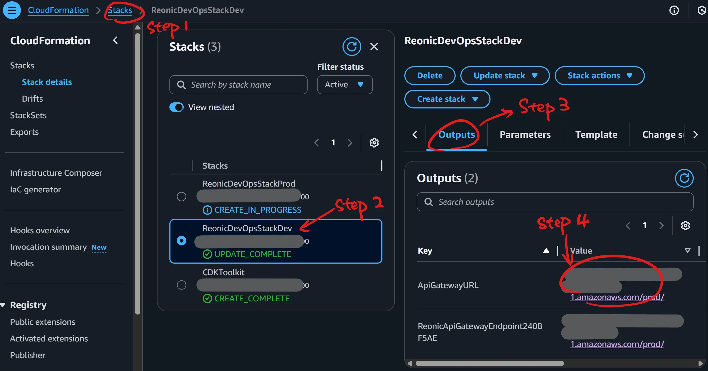
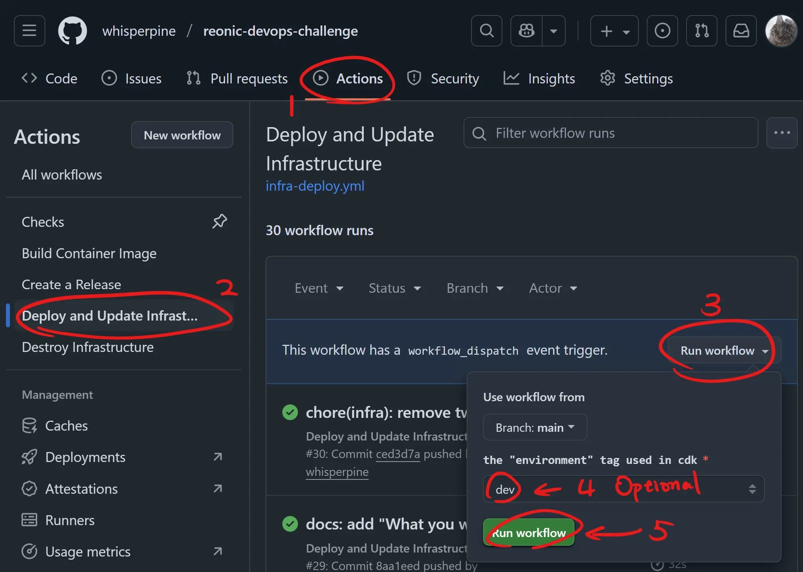

# SUBMISSION

It's an engaging challenge that I enjoyed tackling!

I've accomplished all the objectives in README.md with good practices.

Let's cut to the chase - Here's my solution.

## How to use the solution and test it

### How to test it

For end-to-end test, just open the URL of API Gateway (either in a browser or by
`curl` command). For satefy reasons (though it's public accessible), I choose to
not include the URL directly in this document. Thus you can find the URL in the
AWS Console (I assume you have the permission to access the AWS Console):



:tada: And you'll see something looks like this:

```json
{"message":"Successfully inserted record and retrieved count","insertedId":10,"totalRecords":10,"timestamp":"2025-10-20T17:12:15.396Z"}
```

### How to use the solution in CI

You need to be a github collaborator of this repository to have permissions to
manually trigger the CI/CD pipelines via `workflow_dispatch`. I've already sent
an invitation to Hans (@hanshuebner). Please let me know if there's a permission
issue run trigger CI pipelines (by opening an GitHub Issue or sending me an email).

Assume that Hans has the permission, follow these steps to deploy the cloud infra:



To destroy the infra, just run the "Destroy Infrastructure" workflow with.

### How to use the solution locally

It's generally recommended to use this solution in CI for simplicity.
This section is only useful if you want to try it locally.

Prerequisites:

- The AWS IAM user with permissions to run CDK, and it's already configured.
- Make sure that you have locally install nodejs and [just](https://github.com/casey/just).

Steps:

- Clone this repotory and `cd` into the root directory of this repo.
- Run `just install` command to install npm packages in "node_modules".
- Run `just deploy` command to deploy the dev stack "ReonicDevOpsStackDev".
  (This may take less than 1 minute if there's no changes, and may take no more
  10 minutes if the stack doesn't exist or big changes are made).
- Look around in the AWS console...
- Run `just destroy` command to destroy the dev stack "ReonicDevOpsStackDev".

## What you would improve with more time

- Make changes via Pull Requests rather than pushing directly to the main branch.

- Version management: This is a monorepo (with app and infra in the same
  repository), and the version (including git tag, github release, container
  image tag, versions in `package.json` files) should be managed *separately* by
  splitting app version and infra version. Currently the github release version
  means the infra version, which should be improved as mentioned above.

- Network ACL. Currently the Network ACLs are the default ones created together
  with VPC and subnets. According to the Least Privilege Principle, we'd better
  add more restrictions on it. It's a subnet level network control, an additional
  layer of security other than Security Groups (which are at VM level).

- Preview infra changes before apply. Currently the modification of AWS infra
  happens in one command (e.g. `cdk deploy xxx`) locally or in CI, that's
  dangerous! When I used Terraform to manage cloud infra in other projects, I
  always preview the diff by `terraform plan` and only apply the changes when the
  diff has been proofread by stakeholders in another step. I believe there's a
  similar mechanism in CDK, which I'll sort it out with more time.

- API Gateway path configurations.
  Currently all requests sent to the API Gateway are handled by the single
  Lambda Function `app`. However, in real world, multiple backend applications
  could share the same API Gateway (microservice architecture). The actual
  handler of a request should be configured in API Gateway by rules like URL
  paths.

- ECR image lifecycle rules.
  Currently all the images pushed to the ECR repository stays forever until
  cleaned up manually, which increases cloud cost. A simple lifecycle rule
  could be something like: clear all git-sha-tagged images older than 7 days,
  and always keep the semver-tagged images as well as the "latest" tag.

- IAM user permission. Currently the IAM user used to push container images in
  CI is the same IAM user used to run CDK deployment. This violates the Least
  Privilege Princile. A proper approach is to create a dedicated IAM user only
  with the permission to push and pull images to the specified ECR repository.

- Use a specific container image tag instead of "latest".
  Currently the Lambda Function is using the "latest" tag of the container
  image, which is not a good practice. We'd better use a semver-tagged image.

## "Boasting Time"

There're things that I'd like to share, which could be notable or
nice-to-have, big or small (unordered):

- Modularized file structure.
  The code in [infra-stack.ts](./cdk/lib/infra-stack.ts)
  is pretty simple and linear, as well as documented, so that it's easy to get
  the big picture of the whole cloud infra setup. Every part of the setup has
  its own file (module), like VPC, Lambda, API Gateway, and so on.
  In a more complex cloud infra we can adopt multi-stack, but current approach
  (single stack with modules) suffices so far.

- JSDoc for all exported variables and functions.

- AWS Tags and Resource Group.
  All cloud resources deployed by this repository are all tagged, and
  furthermore the "environment" tag is assigned with "dev" or "prod" depending on
  it's a dev stack `ReonicDevOpsStackDev` or a prodc stack `ReonicDevOpsStackProd`.
  The AWS Resource Group is used to filter resources based on tags
  (see [./cdk/lib/resource-group.ts](./cdk/lib/resource-group.ts)).

- Isolated dev/prod environment.
  This repository supports 2 environments: dev and prod, which can be created and
  managed separately (see `ReonicDevOpsStackDev` and `ReonicDevOpsStackProd` in
  [./cdk/bin/app.ts](./cdk/bin/app.ts)). They're isolated and can exist at the
  same time. They use the same templates (generated by typescript code) and the
  same ci workflow to deploy or destroy (see [infra-deploy.yml](./.github/workflows/infra-deploy.yml)
  and [infra-destroy.yml](./.github/workflows/infra-destroy.yml)).
  Differences: they have different AWS Tags; when triggering CI workflows, the
  have different input values.

- GitHub Environment is corresponding to the Stack environment.
  The GitHub Environment `infra-dev` matches `ReonicDevOpsStackDev` stack,
  while `infra-prod` matches `ReonicDevOpsStackProd` stack. It's useful in CI,
  because different GitHub Environments can have different values of the
  Variables and Secrets used in CI pipelines. We can harness this mechanism
  to make certain parameters differ in "dev" and "prod" environments
  (e.g. The instance type of RDS).

- Dev environment wrapped together with source code.
  This ensures dev environment consistency across developers and everything
  still working when we getting back to it after a long time not touching it.
  This solution is based on [direnv](https://github.com/direnv/direnv)
  and [nix-direnv](https://github.com/nix-community/nix-direnv)
  (relevant files: [flake.nix](./flake.nix), [.envrc](./.envrc)).
  When nix-direnv is set up in your operating system (only requires once),
  everytime you `cd` into this repository, it will make sure: software packages
  are installed with the exact version, and environment variables are loaded in
  the shell (when `cd` out, it works conversely).
  There're other solutions to manage dev environment (e.g. [mise](https://github.com/jdx/mise))
  which we may discuss this topic orally.

- [Conventional Commits](https://www.conventionalcommits.org/en/v1.0.0/)
  and automatic changelog generation based on it (via [git-cliff](https://github.com/orhun/git-cliff)).
  The GitHub release notes are actually generated by this approach.
  Together with [cocogitto](https://github.com/cocogitto/cocogitto)
  we can enforce this convention both in git hooks and CI checks (see [checks.yml](./.github/workflows/checks.yml)).

- Automatic [github release](https://github.com/whisperpine/reonic-devops-challenge/releases)
  when git tagged (in v + [semantic version](https://semver.org/), e.g. `v0.3.0`).
  When we push a git tag, aligning with semver, to the remote repository, the
  CI will automatic create a github pre-release with the auto generated changelog
  as release notes (see [release.yml](./.github/workflows/release.yml)),
  after which we can proofread, make changes (if any), and make the
  pre-release to the latest release.

- Git hooks managed by [husky](https://github.com/typicode/husky).
  The shell scripts right under [.husky/](./.husky/) will be auto installed
  when we `cd` into the directory of this repo (if dev environment is set up as
  mentioned above) if they're missing (see the `shellHook` in
  [flake.nix](./flake.nix)). Those git hooks applies early checks
  (e.g. typos and the violation of Conventional Commits).

- Asymmetric encryption of credentials via [sops](https://github.com/getsops/sops).
  Credentials like AWS Access Key should be kept with care. They're configured
  as secrets of GitHub Actions safely in CI, but we sometimes also need those
  credentials locally - that's where [sops](https://github.com/getsops/sops) shines.
  We can use sops to encrypt credentials in files and make them version
  controlled by git, just like [encrypted.env](./encrypted.env) in this repo.
  In [.sops.yaml](./.sops.yaml) we add public keys so that developers who have
  the paird private keys can decrypt.

- [just](https://github.com/casey/just) a command runner.
  We have a lot of ways to run commands - for developers familiar with nodejs
  ecosystem would often prefer `npm run xxx` for running commands defined in
  [package.json](./package.json) and it is convenient!
  However if you're looking for a general purpose command runner with more
  advanced features, and most importantly, with less keystrokes (`just xxx`),
  I recommend [just](https://github.com/casey/just) (see [justfile](./justfile)).

## AWS Downtime

Coincidently, I encountered a downtime of AWS itself:
[Multiple services were disrupted in us-east-1 on October 20](https://health.aws.amazon.com/health/status?eventID=arn:aws:health:us-east-1::event/MULTIPLE_SERVICES/AWS_MULTIPLE_SERVICES_OPERATIONAL_ISSUE/AWS_MULTIPLE_SERVICES_OPERATIONAL_ISSUE_BA540_514A652BE1A).
During this downtime, the part of the cloud infra were not working, including
the deployed `ReonicDevOpsStackDev` responding with "internal server error" and
new CDK deployment kept failing (see [this github actions execution](https://github.com/whisperpine/reonic-devops-challenge/actions/runs/18644788324/job/53149877855)).

The downtime of a cloud provider rarely happens (but is still possible like this
one). We can make a trade-off here: In mission critical services, *multi-cloud
deployment* is the ultimate solution with the cost of operational overhead; But
if we're allowed to tolerate these sennarios, it would be easier for cloud setup.
In common cases, we can adopt the *multi-regional* solution with a single cloud
provider, this mitigates both concerns: SLA (service level agreement) and
operational overhead.

P.S. Luckily the outage did't end up with troubles for my take-home challenge,
because I accomplished most of the work in weekends, day before this disaster.
Therefore I feel calm at the moment of writing this document.
